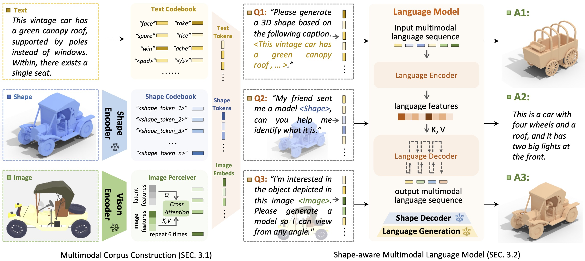

<div align= "center">
    <h1> Official repo for ShapeGPT </h1>

</div>

<div align="center">
    <h3> <a href="https://shapegpt.github.io/">ShapeGPT: 3D Shape Generation with A Unified Multi-modal Language Model</a></h3>

<p align="center">
  <a href="https://shapegpt.github.io/">Project Page</a> •
  <a href="https://arxiv.org/abs/2311.17618">Arxiv Paper</a> •
  Demo •
  <a href="#️-faq">FAQ</a> •
  <a href="#-citation">Citation</a>
</p>

</div>

<div align="center">
</div>
<!--  -->


https://github.com/OpenShapeLab/ShapeGPT/assets/91652696/47cb697b-4778-4046-9e8e-0eafa54d0270


##  Intro ShapeGPT

ShapeGPT is a **unified** and **user-friendly** motion-language model to learn the semantic coupling of two modalities and generate high-quality motions and text descriptions on **multiple motion tasks**.

<details>
    <summary><b>Technical details</b></summary>

The advent of large language models, enabling flexibility through instruction-driven approaches, has revolutionized many traditional generative tasks, but large models for 3D data, particularly in comprehensively handling 3D shapes with other modalities, are still under-explored. By achieving instruction-based shape generations, versatile multimodal generative shape models can significantly benefit various fields like 3D virtual construction and network-aided design. In this work, we present ShapeGPT, a shape-included multi-modal framework to leverage strong pre-trained language models to address multiple shape-relevant tasks. Specifically, ShapeGPT employs a word-sentence-paragraph framework to discretize continuous shapes into shape words, further assembles these words for shape sentences, as well as integrates shape with instructional text for multi-modal paragraphs. To learn this shape-language model, we use a three-stage training scheme, including shape representation, multimodal alignment, and instruction-based generation, to align shape-language codebooks and learn the intricate correlations among these modalities. Extensive experiments demonstrate that ShapeGPT achieves comparable performance across shape-relevant tasks, including text-to-shape, shape-to-text, shape completion, and shape editing.


</details>

## 🚩 News

- [2023/12/01] Upload paper and init project 🔥🔥🔥

## ⚡ Quick Start

<!-- <details>
  <summary><b>Setup and download</b></summary>

</details> -->

## ▶️ Demo

<!-- <details>
  <summary><b>Webui</b></summary>


</details> -->

## 👀 Visualization

## ⚠️ FAQ

<details> <summary><b>Question-and-Answer</b></summary>
    

</details>
</details>

## 📖 Citation

If you find our code or paper helps, please consider citing:

```bibtex
@misc{yin2023shapegpt,
      title={ShapeGPT: 3D Shape Generation with A Unified Multi-modal Language Model}, 
      author={Fukun Yin and Xin Chen and Chi Zhang and Biao Jiang and Zibo Zhao and Jiayuan Fan and Gang Yu and Taihao Li and Tao Chen},
      year={2023},
      eprint={2311.17618},
      archivePrefix={arXiv},
      primaryClass={cs.CV}
}

```

## Acknowledgments

Thanks to [Motion-GPT](https://github.com/OpenMotionLab/MotionGPT) and [SDFusion](https://yccyenchicheng.github.io/SDFusion/), our code is partially borrowing from them.

## License

This code is distributed under an [MIT LICENSE](LICENSE).

Note that our code depends on other libraries, including [PyTorch3D](https://pytorch3d.org/), and uses datasets which each have their own respective licenses that must also be followed.
